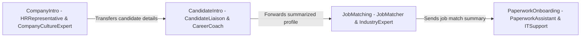
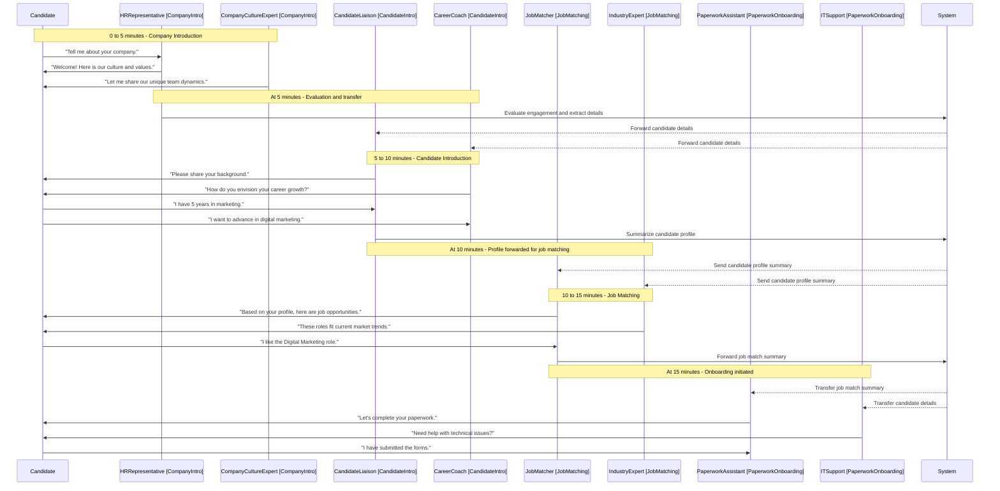
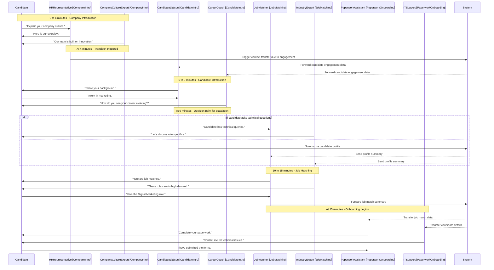
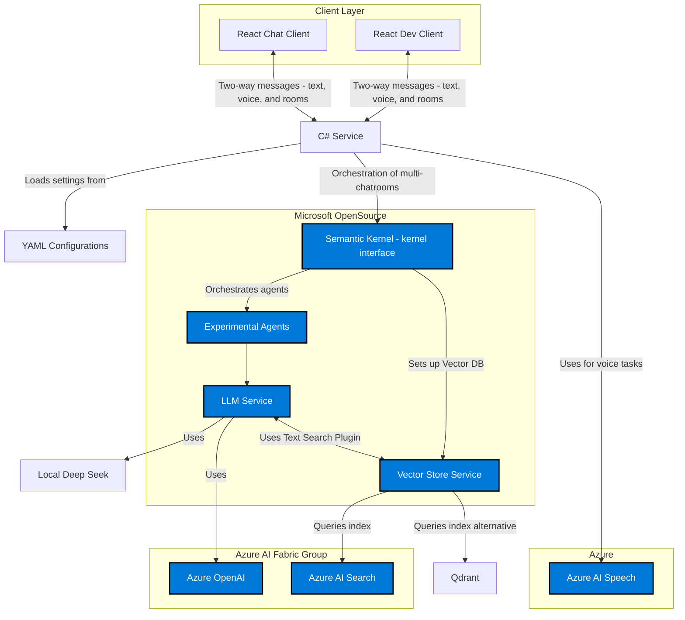

 # White Paper: Agent-Centric Conversational System Configuration  
*Blueprint for Intelligent Dialogue Orchestration*
---
Author: MW (Michael Weilbacher - mweilb@microsoft.com)
3/19/2025

## Abstract

This white paper introduces an abstract configuration format designed to orchestrate agent-centric conversational systems. By defining agents, their contextual behaviors, chatrooms, and dynamic routing strategies, this blueprint enables developers to create intelligent, adaptable dialogue systems. The design emphasizes modularity, context-aware interactions, and the integration of retrieval-augmented generation (RAG) patterns to enrich responses with real-time, relevant content.

---

## Introduction

Modern conversational applications increasingly rely on multi-agent architectures to address complex user interactions. Rather than relying on a single monolithic model, these systems leverage specialized agents—each designed to handle different aspects of a conversation. The configuration format detailed in this paper provides a structured, abstract blueprint to define such systems, ensuring clarity, flexibility, and extensibility.

This approach enables developers to:
- Define distinct agent roles, including the ability for some agents to exhibit advanced contextual behaviors.
- Integrate dynamic content using templated instructions and RAG patterns.
- Organize interactions in thematic chatrooms.
- Employ dynamic routing strategies based on conversation context, including termination and moderation rules.

By abstracting the underlying complexity into a clear configuration file, this format empowers teams to quickly prototype and deploy sophisticated, agent-focused dialogue systems.

---

## Overview of the Configuration Format

At its core, the configuration format is a declarative blueprint that maps out the structure and behavior of an agent-centric conversational system. It is divided into key sections:

1. **Agent Definitions:** Specifies each agent's identity, role, and behavior.
2. **Templated and Contextual Behavior:** Details how agents can be endowed with dynamic, context-specific capabilities.
3. **Chatroom Organization:** Outlines different conversational spaces and assigns agents to these rooms.
4. **Routing and Strategy Rules:** Determines how messages are dynamically handled and routed between agents or chatrooms.
5. **Advanced Selection Strategies:** Explores the node graph-like flow that drives dynamic routing decisions.

Each section contributes to the overall system by ensuring that every message is handled appropriately, the conversation remains focused, and the agents provide contextually relevant information.

---

## Detailed Components

### 1. Agent Definitions

**Purpose:**  
Agents are the core participants in the system. This section allows developers to define each agent’s characteristics and operational guidelines.

**Key Elements:**
- **Visual Identifiers:** Use of emojis or icons to easily distinguish agents.
- **Model References:** Indicate which underlying AI model (e.g., GPT-4) each agent utilizes.
- **Role-Specific Instructions:** Tailored instructions dictate the behavior and focus of each agent. Some agents can additionally be defined with contextual behavior capabilities—allowing them to integrate external data or adjust responses based on conversation context.

**Example – Simple Agent Definition:**

```yaml
agents:
  GeneralAssistant:
    emoji: "💡"
    model: gpt-4
    instructions: "Provide general assistance and clear, concise summaries."
```

*This example defines a single agent, GeneralAssistant, with a clear role and a visual identifier.*

---

### 2. Templated and Contextual Behavior

**Purpose:**  
This section outlines how agents can be endowed with dynamic, context-specific behaviors. Some agents are defined with templated instructions that allow them to query external sources (like vector databases or code repositories) to fetch real-time data. This capability—often implemented via Retrieval Augmented Generation (RAG) patterns—enables these agents to integrate external content into their responses dynamically.

**Key Elements:**
- **Templating Logic:** Instructions to fetch and integrate external data.
- **Contextual Capabilities:** Specific agents can be designed to adapt their responses based on external context or user input.
- **RAG Pattern Integration:** Facilitates dynamic querying of repositories to retrieve context-specific information.

**Example – Agent with RAG Capabilities and Contextual Behavior:**

```yaml
agents:
  CodeReviewer:
    emoji: "🎨"
    model: gpt-4
    collection:
      name: SourceForCSharp
      structure: TextParagraph
      top: 2
      skip: 0
    instructions: >
      {{#with (SourceForCSharp-GetTextSearchResults query)}}
        {{#each this}}
          Name: {{Name}}
          Value: {{Value}}
          Link: {{Link}}
          -----------------
        {{/each}}
      {{/with}}
      Provide a detailed review based on the retrieved content.
```

*In this example, the CodeReviewer agent is equipped with contextual behavior. It uses templated logic to query a repository named SourceForCSharp and integrates relevant content into its responses.*

---

### 3. Chatroom Organization

**Purpose:**  
Chatrooms serve as distinct conversation spaces, each targeting specific interaction types or topics.

**Key Elements:**
- **Thematic Segmentation:** Create spaces for general discussion, technical support, research, etc.
- **Agent Assignment:** Specify which agents participate in each chatroom.
- **Visual Metadata:** Use emojis and positional data to enhance the user experience and clarify agent participation.

**Example – Defining a Chatroom:**

```yaml
chatrooms:
  GeneralChat:
    emoji: "🗣"
    label: "General Discussion"
    agents:
      - name: GeneralAssistant
        position: { x: 100, y: 200 }
```

*This snippet creates a chatroom called GeneralChat where the GeneralAssistant is positioned for easy identification and engagement.*

---

### 4. Routing and Strategy Rules

**Purpose:**  
Routing rules manage the flow of conversation by dynamically determining which agent or chatroom should handle each incoming message. These strategies ensure that the conversation stays on track, transitions smoothly between different contexts, and handles situations where conversations need to be ended or escalated for human moderation.

**Key Elements:**
- **Selection Rules:**  
  Evaluate incoming messages based on metadata (e.g., message order, origin) to decide the routing path. These rules determine whether a message should remain with the current agent, be forwarded to another agent, or be transferred to a different chatroom.

- **Termination Criteria:**  
  Define conditions under which a conversation should conclude or transition. Termination rules help prevent conversations from lingering indefinitely by detecting prolonged inactivity or recognizing that a dialogue has reached a natural end.

- **Moderation Prompts:**  
  Establish guidelines for when human oversight might be required. Moderation rules flag sensitive or potentially risky content, escalating the conversation to a human moderator when necessary.

**Example – Basic Routing Strategy:**

```yaml
strategies:
  selections:
    - name: BasicRouting
      current:
        - name: GeneralAssistant
      decision:
        prompt: "Evaluate the latest message for relevance."
        messages-filter: "Select the latest message."
      next:
        - name: GeneralAssistant
```

*This strategy ensures that messages coming from the GeneralAssistant are evaluated and routed accordingly, maintaining a consistent conversation flow.*

**Example – Termination and Moderation Strategy:**

```yaml
strategies:
  termination:
    prompt: "Determine if the conversation should be ended due to inactivity or completion."
    messages-filter: "Evaluate the time elapsed since the last message."
  moderation:
    prompt: "Assess if the content requires escalation to a human moderator."
    messages-filter: "Evaluate the latest message for potential policy violations."
```

*In this example, termination strategies help conclude conversations that have been inactive, while moderation prompts trigger human intervention when needed.*

**Context-Transfer for Chatroom Routing**

When routing a message to another chatroom, a context-transfer block ensures continuity by passing along essential details from the original conversation.

**Example – Escalating to a Technical Chatroom with Context-Transfer:**

```yaml
strategies:
  selections:
    - name: EscalateToTech
      current:
        - name: GeneralAssistant
      decision:
        prompt: "Evaluate if the message contains technical content."
        messages-filter: "Select the latest message."
      next:
        - name: TechChatroom
          context-transfer:
            prompt: "Transfer the user’s technical query with relevant context."
            messages-filter: "Retrieve the latest user message, removing unnecessary details."
```

*Here, if a message from GeneralAssistant is determined to contain technical content, it is routed to TechChatroom. The context-transfer block ensures that only the essential details are passed on, maintaining the conversation’s context.*

---

### 5. Advanced Selection Strategies: A Node Graph Perspective

**Purpose:**  
This section dives deeper into the selection strategy and explains how it functions like a node graph. Each agent or chatroom can be seen as a node in a dynamic conversation flow, where messages traverse between nodes based on predefined rules and decision criteria.

**Key Concepts:**

- **Node Graph Flow:**  
  Visualize each agent or chatroom as a node. The selection strategy acts as a set of edges connecting these nodes. Each edge represents a potential transition path that a message can follow.  
  - **Nodes:** Represent agents or chatrooms.
  - **Edges:** Represent the routing decisions based on the current message’s metadata and context.

- **Dynamic Routing:**  
  When a message is received, the selection strategy evaluates the current node (the originating agent) and uses decision prompts to determine the best next node. This node can be:
  - **Another Agent:** Redirecting the conversation for specialized handling.
  - **Another Chatroom:** Transferring the conversation to a different context with the aid of context-transfer mechanisms.

- **Flexibility and Power:**  
  By leveraging a node graph-like structure, the system enables complex, branching dialogue flows. This dynamic routing allows:
  - **Adaptive Conversations:** The system can pivot based on message content, ensuring that users receive responses from the most appropriate expertise.
  - **Scalability:** New nodes (agents or chatrooms) can be added without disrupting the overall flow.
  - **Enhanced User Experience:** Users benefit from a seamless transition between different conversational contexts, making the dialogue both intuitive and efficient.

**Example – Advanced Selection Strategy Node Graph:**

```yaml
strategies:
  selections:
    - name: AdvancedRouting
      current:
        - name: GeneralAssistant
        - name: CodeReviewer
      decision:
        prompt: "Assess if the message requires escalation or specialized handling."
        messages-filter: "Select the latest message from the user."
      next:
        - name: TechnicalSpecialist
        - name: ResearchChatroom
          context-transfer:
            prompt: "Forward the query with key context details."
            messages-filter: "Extract and summarize the user's latest inquiry."
```

*In this advanced example, the selection strategy considers messages from multiple nodes (GeneralAssistant and CodeReviewer). Based on the decision prompt, the message may be routed to a TechnicalSpecialist or transferred to ResearchChatroom with context-transfer ensuring continuity.*

**Benefits to the User:**
- **Seamless Transitions:** Users experience a fluid conversation where the system intelligently navigates through various nodes.
- **Specialized Handling:** Each query can be routed to the most knowledgeable node, ensuring accurate and relevant responses.
- **Adaptability:** The system can evolve with new nodes added over time, continuously improving the interaction flow.

---

## Use Case Examples

### Customer Support
- **Agents:**  
  A general support agent and a technical specialist.
- **Chatrooms:**  
  GeneralSupport for initial queries and TechnicalSupport for more complex issues.
- **Routing:**  
  Initial inquiries are handled by the general agent; technical queries are escalated to the technical specialist using dynamic routing, context-transfer, and, when necessary, termination or moderation protocols.

### Code Review and Technical Documentation
- **Agent with RAG:**  
  A CodeReviewer agent queries a repository of code snippets and documentation.
- **Chatrooms:**  
  A dedicated CodeReview chatroom for technical discussions.
- **Routing:**  
  Code-related queries are routed to the CodeReviewer, which dynamically retrieves and integrates relevant documentation.

### Robust Use Case for Hiring with Multiple Chatrooms

To streamline the recruitment process, consider a hiring experience divided into four distinct stages:

1. **Company Intro:** Where candidates learn about the company.  
2. **Candidate Introduction:** Where the company gets to know the candidate.  
3. **Job Matching:** Where suitable job openings are identified.  
4. **Paperwork Onboarding:** Where candidates complete the necessary paperwork.

**YAML Configuration Example:**

```yaml
HiringExperience:
  emoji: "🏢"
  start_room: CompanyIntro
  agents:
    HRRepresentative:
      emoji: "🤝"
      model: gpt-4
      instructions: >
        Introduce the company culture, vision, and values. Engage candidates with an overview of our history, achievements, and future goals.
    CompanyCultureExpert:
      emoji: "🎤"
      model: gpt-4
      instructions: >
        Provide deeper insights into the company's mission, values, and team dynamics. Highlight what makes the culture unique.
    CandidateLiaison:
      emoji: "👤"
      model: gpt-4
      instructions: >
        Collect candidate background information. Ask probing questions to understand their experience, interests, and career aspirations.
    CareerCoach:
      emoji: "💼"
      model: gpt-4
      instructions: >
        Advise candidates on career development and preparation. Provide tips and recommendations to enhance their profile.
    JobMatcher:
      emoji: "🔍"
      model: gpt-4
      instructions: >
        Analyze candidate profiles and match them with the right job openings. Provide details about job roles and requirements.
    IndustryExpert:
      emoji: "📊"
      model: gpt-4
      instructions: >
        Offer insights on industry trends and specific role requirements. Validate and refine job matches based on market needs.
    PaperworkAssistant:
      emoji: "📝"
      model: gpt-4
      instructions: >
        Guide candidates through the onboarding paperwork. Ensure all required fields are completed and clarify any doubts regarding form entries.
    ITSupport:
      emoji: "💻"
      model: gpt-4
      instructions: >
        Provide technical support for any issues encountered during the paperwork or onboarding process.
  
  chatrooms:
    CompanyIntro:
      emoji: "🏢"
      label: "Get to Know Our Company"
      agents:
        - name: HRRepresentative
          position: { x: 100, y: 100 }
        - name: CompanyCultureExpert
          position: { x: 120, y: 100 }
      strategies:
        selections:
          - name: IntroRouting
            current:
              - name: HRRepresentative
              - name: CompanyCultureExpert
            decision:
              prompt: "Assess candidate engagement based on initial questions and responses."
              messages-filter: "Select the latest message."
            next:
              - name: CandidateIntro
                context-transfer:
                  prompt: "Pass candidate's introductory responses to the next stage."
                  messages-filter: "Extract key candidate details."
        termination:
          prompt: "End the introduction phase if the candidate has received sufficient company info."
          messages-filter: "Check for inactivity or completion indicators."
  
    CandidateIntro:
      emoji: "👤"
      label: "Tell Us About Yourself"
      agents:
        - name: CandidateLiaison
          position: { x: 150, y: 100 }
        - name: CareerCoach
          position: { x: 170, y: 100 }
      strategies:
        selections:
          - name: ProfileEvaluation
            current:
              - name: CandidateLiaison
              - name: CareerCoach
            decision:
              prompt: "Evaluate candidate responses to determine if they meet initial criteria."
              messages-filter: "Analyze the latest detailed message."
            next:
              - name: JobMatching
                context-transfer:
                  prompt: "Forward summarized candidate profile to the job matching stage."
                  messages-filter: "Extract and summarize candidate details."
        termination:
          prompt: "Conclude candidate introduction if no further information is provided."
          messages-filter: "Monitor last message for brevity or inactivity."
  
    JobMatching:
      emoji: "🔍"
      label: "Find the Right Job"
      agents:
        - name: JobMatcher
          position: { x: 200, y: 150 }
        - name: IndustryExpert
          position: { x: 220, y: 150 }
      strategies:
        selections:
          - name: MatchEvaluation
            current:
              - name: JobMatcher
              - name: IndustryExpert
            decision:
              prompt: "Determine the most suitable job openings based on the candidate profile."
              messages-filter: "Review candidate details and match criteria."
            next:
              - name: PaperworkOnboarding
                context-transfer:
                  prompt: "Forward matched job details and candidate summary for onboarding."
                  messages-filter: "Extract job match summary."
        termination:
          prompt: "Conclude job matching if a candidate accepts a role or opts out."
          messages-filter: "Check for acceptance or opt-out messages."
  
    PaperworkOnboarding:
      emoji: "📝"
      label: "Complete Your Paperwork"
      agents:
        - name: PaperworkAssistant
          position: { x: 250, y: 200 }
        - name: ITSupport
          position: { x: 270, y: 200 }
      strategies:
        selections:
          - name: PaperworkGuidance
            current:
              - name: PaperworkAssistant
              - name: ITSupport
            decision:
              prompt: "Guide the candidate through onboarding forms step by step."
              messages-filter: "Extract responses from form fields."
            next:
              - name: PaperworkAssistant
        termination:
          prompt: "Finalize the process once all necessary paperwork is submitted."
          messages-filter: "Verify submission confirmation."
```

**Explanation:**

- **Agents:**  
  - **HRRepresentative:** Initiates the process by introducing the company and its culture.  
  - **CompanyCultureExpert:** Delivers deeper insights into the company’s unique culture and team dynamics.  
  - **CandidateLiaison:** Gathers essential background details from the candidate.  
  - **CareerCoach:** Provides personalized career advice and helps the candidate articulate their goals.  
  - **JobMatcher:** Analyzes the candidate’s profile and suggests suitable job openings.  
  - **IndustryExpert:** Offers industry-specific insights to refine and validate job matches.  
  - **PaperworkAssistant:** Guides the candidate through the onboarding documentation.  
  - **ITSupport:** Offers technical support during the onboarding process.

- **Chatrooms:**  
  - **CompanyIntro:** Features both HRRepresentative and CompanyCultureExpert to provide a well-rounded introduction to the company.  
  - **CandidateIntro:** Combines the efforts of CandidateLiaison and CareerCoach to collect and enrich the candidate’s profile.  
  - **JobMatching:** Uses the combined expertise of JobMatcher and IndustryExpert to determine the best job matches.  
  - **PaperworkOnboarding:** Integrates PaperworkAssistant and ITSupport to ensure a smooth, error-free onboarding process.

- **Dynamic Routing:**  
  Each chatroom uses selection strategies and context-transfer blocks to evaluate messages and seamlessly transition the candidate through the process.

---

## Chat Flow Diagrams

To tell the story of the candidate’s journey, the diagrams below illustrate both the overall structure and the detailed timing of interactions.

### Diagram 1: Chatroom Overview



**Story:**  
The candidate begins in the CompanyIntro chatroom, receiving a warm welcome and a deep dive into the company culture. Their engagement is evaluated and essential details are transferred to CandidateIntro, where both a liaison and a career coach help build a comprehensive profile. Next, the profile is forwarded to JobMatching, where job opportunities are refined with input from an industry expert. Finally, the journey culminates in the PaperworkOnboarding chatroom, where administrative and technical support ensure all final steps are completed.

---

### Diagram 2: Timing Diagram – Linear Conversation Flow



**Story:**  
Over a 20-minute span, the candidate’s journey unfolds sequentially. The conversation begins with a warm introduction in CompanyIntro, followed by a detailed CandidateIntro phase where personal background is shared and summarized. The profile is then forwarded to JobMatching, where opportunities are discussed. Finally, the conversation moves to PaperworkOnboarding, ensuring all documentation is completed with technical support if needed.

---

### Diagram 3: Timing Diagram – Dynamic Flow with Escalation



**Story:**  
In this dynamic flow, after the initial introduction, the candidate’s engagement triggers a context-transfer that quickly moves the conversation to CandidateIntro. At a decision point, if technical queries arise, the system escalates immediately to JobMatching where specialized input is provided. Otherwise, the flow continues linearly. Finally, the onboarding stage begins with administrative and technical support collaborating to ensure a smooth process.

---

## Practical Guidance: How to Use the Format

### Step 1: Define Your Agents
- **Identify Roles:**  
  Determine the types of agents you need (e.g., general assistant, technical expert, security monitor) and decide which ones should have contextual behavior.
- **Create YAML Definitions:**  
  For each agent, include properties such as visual identifiers, model references, role-specific instructions, and, if applicable, templated behavior for dynamic content retrieval.

### Step 2: Organize Chatrooms
- **Determine Interaction Spaces:**  
  Decide on thematic categories (e.g., general inquiries, technical support).
- **Assign Agents:**  
  List which agents belong to each chatroom, and specify any necessary positional data.

### Step 3: Integrate Dynamic Content and Contextual Behavior
- **Embed Templated Instructions:**  
  Define agents with contextual behavior by incorporating templated logic to fetch and integrate external data.
- **Enable RAG Patterns:**  
  Configure agents to query external collections or databases, enriching responses with context-specific data.

### Step 4: Establish Routing Rules
- **Design Routing Strategies:**  
  Define rules that decide how to route incoming messages based on metadata (such as origin or message order).
- **Implement Termination and Moderation:**  
  Establish criteria to end conversations due to inactivity or completion, and set moderation prompts to escalate potentially sensitive content.

---

 
### Architecture Overview

This architecture diagram represents a multi-modal conversational system that integrates a React-based client (including both chat and development interfaces) with a backend C# Service. The C# Service loads configuration settings from a YAML file and orchestrates conversational workflows via Semantic Kernel (packaged as part of Microsoft OpenSource). Semantic Kernel coordinates calls to an LLM Service and a Vector Store Service while also leveraging various Azure services—such as Azure OpenAI, Azure AI Search, and Azure AI Speech—for language processing, semantic search, and voice synthesis. Local alternatives like Local Deep Seek and Qdrant provide additional flexibility for on-premise or alternative deployments.


### Architecture Diagram




### Explanation

- **Client Layer:**
  - **React Chat Client & React Dev Client:**  
    These front-end interfaces allow both end users and developers to interact with the system. They support two-way communication, sending messages and receiving responses from the backend service.
    - *Learn more about React front-end development:* [React Documentation](https://reactjs.org/docs/getting-started.html) and [Microsoft's SPA templates for React](https://learn.microsoft.com/en-us/aspnet/core/client-side/spa/react).

- **C# Service & YAML Configurations:**
  - **C# Service:**  
    Acts as the main entry point for processing messages. It loads system configurations from a YAML file that defines agents, routing rules, and chatroom settings, ensuring the system is flexible and dynamically configurable.
    - *For YAML and C# integration, refer to:* [YAML in .NET](https://github.com/aaubry/YamlDotNet).
  - **YAML Configurations:**  
    This file contains the system's configuration data, making it easy to update and manage settings without altering the code.

- **Microsoft OpenSource Group:**
  - **Semantic Kernel (SK - kernel interface):**  
    A key component for orchestrating multi-agent interactions and natural language processing. It’s part of Microsoft’s open source initiative and handles tasks like language understanding, context management, and routing.
    - *Explore Semantic Kernel on GitHub:* [Microsoft Semantic Kernel](https://github.com/microsoft/semantic-kernel)  
    - *Additional reference:* [Microsoft Open Source at Microsoft](https://opensource.microsoft.com/).
  - **LLM Service:**  
    Provides language generation and comprehension, enabling the system to generate responses based on user inputs. It leverages both cloud-based and local language models.
  - **Vector Store Service (VDB):**  
    Manages semantic vector storage and retrieval, supporting context-aware conversation by enabling efficient semantic searches.
  - **Experimental Agents:**  
    Specialized agents that perform additional tasks or experiment with new features to enhance conversation quality.

- **Local Alternatives:**
  - **Local Deep Seek (LDS):**  
    A local service used for deep search or language processing tasks, offering an alternative to cloud-based services.
  - **Qdrant (QDR):**  
    A vector database solution that provides an alternative to Azure AI Search, enabling semantic searches and context retrieval.
    - *Learn more about Qdrant:* [Qdrant Documentation](https://qdrant.tech/documentation/).

- **Azure AI Fabric Group & Azure Group (Voice):**
  - **Azure OpenAI (AOA):**  
    Provides advanced language modeling and generation capabilities in the cloud. It’s used by the LLM Service for processing natural language inputs.
    - *Reference:* [Azure OpenAI Service Documentation](https://learn.microsoft.com/en-us/azure/cognitive-services/openai/).
  - **Azure AI Search (AAIS):**  
    Offers semantic search and indexing capabilities, which are used by the Vector Store Service for efficient context retrieval.
    - *Reference:* [Azure Cognitive Search Documentation](https://learn.microsoft.com/en-us/azure/search/).
  - **Azure AI Speech (AAISpeech):**  
    Handles voice synthesis and speech recognition tasks. The C# Service calls a dedicated Voice Synthesis Directory that uses this service.
    - *Reference:* [Azure Speech Services Documentation](https://learn.microsoft.com/en-us/azure/cognitive-services/speech-service/).

- **Connections & Communication Flow:**
  - **Two-way Messaging:**  
    The React clients send messages to the C# Service and receive responses in real time, enabling interactive conversations.
  - **Orchestration:**  
    The C# Service loads configurations and directs processing to Semantic Kernel, which orchestrates agent interactions and routes tasks to language models and vector search services.
  - **Voice Processing:**  
    For voice-enabled interactions, the C# Service directly calls the Voice Synthesis Directory, which integrates with Azure AI Speech.

---


## Conclusion

This configuration format offers a powerful, abstract blueprint for building agent-centric conversational systems. Its modular design—with clearly defined agent roles (including contextual behavior), organized chatrooms, dynamic routing strategies, and advanced content retrieval methods—empowers developers to create intelligent, context-aware dialogue systems.

By following the examples provided and adapting the YAML format to your specific needs, you can rapidly prototype and deploy sophisticated multi-agent architectures. These systems are capable of handling complex conversations, enriching user interactions with real-time data, and maintaining a structured dialogue flow—all while being easy to scale and customize. The built-in termination, moderation, and advanced selection strategies further ensure that conversations remain focused and secure, offering a complete solution for managing dynamic dialogue flows.

Use this format as a foundation for creating robust, dynamic conversational applications that seamlessly transition between agents and chatrooms, ensuring every message is enriched with the proper context and handled by the most appropriate expertise.

 

### References

- **Semantic Kernel:**  
  [Microsoft Semantic Kernel on GitHub](https://github.com/microsoft/semantic-kernel)  
  A detailed look at Microsoft’s open source orchestration framework for natural language tasks.

- **Azure OpenAI Service:**  
  [Azure OpenAI Service Documentation](https://learn.microsoft.com/en-us/azure/cognitive-services/openai/)  
  Comprehensive documentation on using Azure OpenAI for language modeling.

- **Azure Cognitive Search:**  
  [Azure Cognitive Search Documentation](https://learn.microsoft.com/en-us/azure/search/)  
  Information on leveraging Azure AI Search for semantic indexing and search.

- **Azure Speech Services:**  
  [Azure Speech Services Documentation](https://learn.microsoft.com/en-us/azure/cognitive-services/speech-service/)  
  Guidelines for implementing voice synthesis and speech recognition with Azure AI Speech.

- **Qdrant:**  
  [Qdrant Documentation](https://qdrant.tech/documentation/)  
  Explore this vector database solution for semantic search applications.

- **React Documentation:**  
  [React Official Documentation](https://reactjs.org/docs/getting-started.html)  
  Learn more about building modern web applications with React.

- **YAML in .NET:**  
  [YamlDotNet GitHub Repository](https://github.com/aaubry/YamlDotNet)  
  A resource for working with YAML in C# applications.

 