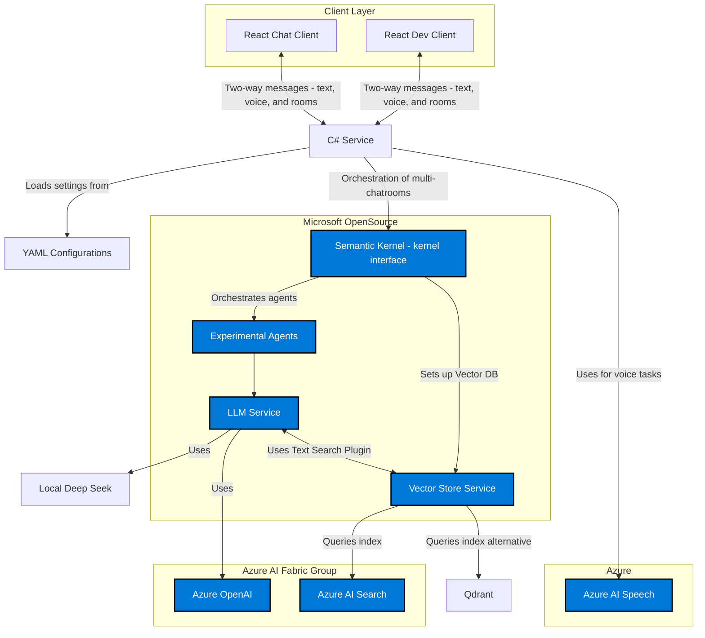

 
### Architecture Diagram

### Explanation

- **Client Layer:**
  - **React Chat Client & React Dev Client:**  
    These front-end interfaces allow both end users and developers to interact with the system. They support two-way communication, sending messages and receiving responses from the backend service.
    - *Learn more about React front-end development:* [React Documentation](https://reactjs.org/docs/getting-started.html) and [Microsoft's SPA templates for React](https://learn.microsoft.com/en-us/aspnet/core/client-side/spa/react).

- **C# Service & YAML Configurations:**
  - **C# Service:**  
    Acts as the main entry point for processing messages. It loads system configurations from a YAML file that defines agents, routing rules, and chatroom settings, ensuring the system is flexible and dynamically configurable.
    - *For YAML and C# integration, refer to:* [YAML in .NET](https://github.com/aaubry/YamlDotNet).
  - **YAML Configurations:**  
    This file contains the system's configuration data, making it easy to update and manage settings without altering the code.

- **Microsoft OpenSource Group:**
  - **Semantic Kernel (SK - kernel interface):**  
    A key component for orchestrating multi-agent interactions and natural language processing. It’s part of Microsoft’s open source initiative and handles tasks like language understanding, context management, and routing.
    - *Explore Semantic Kernel on GitHub:* [Microsoft Semantic Kernel](https://github.com/microsoft/semantic-kernel)  
    - *Additional reference:* [Microsoft Open Source at Microsoft](https://opensource.microsoft.com/).
  - **LLM Service:**  
    Provides language generation and comprehension, enabling the system to generate responses based on user inputs. It leverages both cloud-based and local language models.
  - **Vector Store Service (VDB):**  
    Manages semantic vector storage and retrieval, supporting context-aware conversation by enabling efficient semantic searches.
  - **Experimental Agents:**  
    Specialized agents that perform additional tasks or experiment with new features to enhance conversation quality.

- **Local Alternatives:**
  - **Local Deep Seek (LDS):**  
    A local service used for deep search or language processing tasks, offering an alternative to cloud-based services.
  - **Qdrant (QDR):**  
    A vector database solution that provides an alternative to Azure AI Search, enabling semantic searches and context retrieval.
    - *Learn more about Qdrant:* [Qdrant Documentation](https://qdrant.tech/documentation/).

- **Azure AI Fabric Group & Azure Group (Voice):**
  - **Azure OpenAI (AOA):**  
    Provides advanced language modeling and generation capabilities in the cloud. It’s used by the LLM Service for processing natural language inputs.
    - *Reference:* [Azure OpenAI Service Documentation](https://learn.microsoft.com/en-us/azure/cognitive-services/openai/).
  - **Azure AI Search (AAIS):**  
    Offers semantic search and indexing capabilities, which are used by the Vector Store Service for efficient context retrieval.
    - *Reference:* [Azure Cognitive Search Documentation](https://learn.microsoft.com/en-us/azure/search/).
  - **Azure AI Speech (AAISpeech):**  
    Handles voice synthesis and speech recognition tasks. The C# Service calls a dedicated Voice Synthesis Directory that uses this service.
    - *Reference:* [Azure Speech Services Documentation](https://learn.microsoft.com/en-us/azure/cognitive-services/speech-service/).

- **Connections & Communication Flow:**
  - **Two-way Messaging:**  
    The React clients send messages to the C# Service and receive responses in real time, enabling interactive conversations.
  - **Orchestration:**  
    The C# Service loads configurations and directs processing to Semantic Kernel, which orchestrates agent interactions and routes tasks to language models and vector search services.
  - **Voice Processing:**  
    For voice-enabled interactions, the C# Service directly calls the Voice Synthesis Directory, which integrates with Azure AI Speech.

---

 